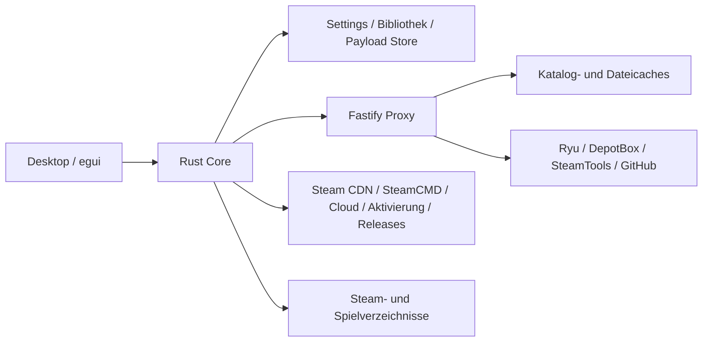

# Drydock — Repository-Review

> Nachfolgende Umsetzung: [Korrekturen und Verifikation](C:/Users/Administrator/Documents/GitHub/Drydock/docs/REVIEW_FIXES_2026-09-15.md). Dieser Bericht beschreibt den ursprünglichen Befund vor den Korrekturen.

**Stand:** 15. September 2026  
**Basis:** Commit `4309cdf86faf6597c6e4346b7ebd1d3e2265ce20`, einschließlich des vorgefundenen Arbeitsstands.  
**Ergebnis:** 24 priorisierte Befunde: **13 × P1, 10 × P2, 1 × P3**. Kein belegter P0. Zwei zusätzliche Prüfpunkte sind ausdrücklich noch zu verifizieren.  
**Änderungen:** Kein Anwendungscode refaktoriert oder korrigiert. Die bereits vorhandene Änderung an `.github/workflows/release.yml` bleibt erhalten. Dieser Bericht und isolierte Reproduktionsartefakte sind neu.

## Untersuchungsrahmen und Systemmodell

Untersucht wurden Repositorystruktur, die Rust-Anwendung und Core-Module, TypeScript-Proxy einschließlich Routes/Caches/Auth, Konfiguration, beide Lockfiles, Docker/Compose, CI-/Releaseworkflows, Beispiele, Hilfsskripte und vorhandene Tests. Die Analyse folgt insbesondere Daten- und Fehlerflüssen über Modulgrenzen. Sie ist eine repo-weite statische und gezielt dynamische Prüfung; sie behauptet keine vollständige Pfadabdeckung jeder möglichen Eingabe.

| Bereich | Umsetzung und Verantwortung |
| --- | --- |
| Desktop | Rust 2024; eframe/egui; Windows- und Linux-Buildziele. `main.rs` übernimmt Start, Selbsttest, Härtung und unter Windows Release-Elevation. `ui.rs` hält Darstellung, Receiver und erhebliche fachliche Orchestrierung. |
| Core | `drydock-core`: Steam-Erkennung, Bibliothek, Settings, Queue, Depotmanifeste, Chunkdownload/-prüfung, Service-/Lua-Installation, Fixes, Aktivierung, Emulator-Toolchain, Cloud und Selfupdate. |
| Proxy | Node.js, striktes TypeScript, Fastify 5; HTTP-Routen für Katalog, Lua, Depotpakete, Service, Fixes, Repacks und weitere Metadaten. |
| Persistenz | Lokale JSON-Dateien, Settingsbackup/Quarantäne, App-Payload-Verzeichnisse, Steam-Manifeste und Dateicaches. **Keine relationale Datenbank, kein ORM, kein Redis.** SQL, Indizes und N+1-Datenbankabfragen sind daher nicht anwendbar. |
| Hintergrundarbeit | Desktop: native Threads, atomare Abbruchflags und mpsc-Receiver; persistierte Downloadqueue. Proxy: Timer für Refresh/Sweep, in-process Maps und Promise-Deduplizierung. Kein externer Queuebroker. |
| Externe Quellen | Provider Ryu, DepotBox und SteamTools über den Proxy; GitHub für Payloads und Releases. Der Desktop greift daneben direkt unter anderem auf Steam/CDNs, SteamCMD-Mirror, Cloud-/Aktivierungsdienste und GitHub zu. Der Proxy ist damit keine vollständige Netzwerk- oder Vertrauensgrenze. |
| Auth und Kryptografie | Proxy: HMAC mit Zeitfenster, Nonce-Replayschutz, Secretrotation; IP-Ratelimits. Der im Desktop eingebettete gemeinsame Schlüssel ist ein Zugangshindernis für fremde Clients, keine individuelle Nutzerautorisierung. Core: signierte Aktivierungsdaten, RSA/AES-Verarbeitung und Cloud-OAuth. |
| Deployment | Mehrstufiges Dockerimage mit unprivilegiertem Node-Nutzer; Compose mit persistentem Datenvolume und lokal gebundenem Hostport; Reverse-Proxy-Beispiel. Rust-Releaseartefakte für vier Plattformziele. |
| Binärbestandteile | Mitgelieferte `emu/*.dll` und externe Binärpayloads. Aufruf-, Download- und Installationspfade wurden bewertet; die internen Implementierungen dieser Binärdateien wurden nicht aus Quellcode auditiert. |

### Wesentliche Datenflüsse

Besonders geprüft wurden:

- **Download:** UI-Queue → Pfadauflösung → Manifest/Schlüssel → parallele Chunks → Dateisystem → Queueabschluss → Bibliotheksregistrierung.
- **Service/Fix:** externe Beschreibung/Hash → Download → Staging/Backup → Überschreiben → Marker/Status → Rollback.
- **Proxy:** HMAC/Rate-Limit → Route → Providerfallback → deduplizierter Stream → Dateicache → Sweep.
- **Recovery:** Settings laden → Backup/Quarantäne/Schreibschutz → UI-Aktion → persistenter Zustand.
- **Darstellung:** Bild-URI → eigener Bytescache → egui-Decoder → GPU-Textur. Diese getrennten Speicherbesitzer sind für F16 entscheidend.

## Einzelbefunde

Die Reihenfolge gruppiert hohe Priorität zuerst. „Reproduziert“ bedeutet einen isolierten lokalen Nachweis. „Im Code bestätigt“ bedeutet eine nachvollziehbare erreichbare Bedingung, aber keinen behaupteten Livevorfall. Aufwand und Änderungsrisiko beziehen sich auf die empfohlene Lösung einschließlich passender Regressionstests.

### [P1] F01 — Unicode-Dateiname bringt den Plug-in-Scan zum Absturz

**Datei:** [crates/drydock-core/src/steam_service.rs](C:/Users/Administrator/Documents/GitHub/Drydock/crates/drydock-core/src/steam_service.rs:460); [apps/drydock-desktop/src/ui.rs](C:/Users/Administrator/Documents/GitHub/Drydock/apps/drydock-desktop/src/ui.rs:2373)  
**Zeilen / Bereich:** steam_service.rs: 460–480; ui.rs: 2373–2380, 6559–6565  
**Kategorie:** Bug

**Problem:** Der Suffixcheck schneidet einen UTF-8-String mit einem Byteindex an. `name.len() - 4` muss keine Zeichengrenze sein. **Reproduziert:** Eine Datei namens `备份说明` löst in `installed_app_luas` eine Panic aus.

**Warum problematisch:** Der Scan läuft beim Seitenwechsel bzw. Aktualisieren des Zustands. Im Releaseprofil ist `panic = "abort"` gesetzt; damit beendet sich die gesamte Anwendung.

**Wann tritt es auf:** Eine entsprechende Nicht-Lua-Datei liegt in `Steam/config/stplug-in`; der Nutzer öffnet anschließend eine andere Seite oder löst einen Refresh aus.

**Empfohlene Lösung:** Die Erweiterung über `Path::extension` vergleichen und erst danach den Dateistamm als App-ID parsen. Regressionstest mit mehrbyteigen Namen, kurzen Namen und `.LUA` ergänzen.

**Risiko der Änderung:** Niedrig  
**Aufwand:** Klein

### [P1] F02 — Download-Limiter wartet bei zu großen Chunks endlos

**Datei:** [crates/drydock-core/src/depot/download.rs](C:/Users/Administrator/Documents/GitHub/Drydock/crates/drydock-core/src/depot/download.rs:486); [apps/drydock-desktop/src/ui.rs](C:/Users/Administrator/Documents/GitHub/Drydock/apps/drydock-desktop/src/ui.rs:1497)  
**Zeilen / Bereich:** download.rs: 350–351, 486–517; ui.rs: 1497–1500  
**Kategorie:** Bug / Performance

**Problem:** Der Tokenvorrat ist auf `max_bps` begrenzt; `take(bytes)` kehrt ausschließlich bei `tokens >= bytes` zurück. Für `bytes > max_bps` ist diese Bedingung unerreichbar. **Reproduziert:** 1 MiB/s und 1 MiB + 32 angeforderte Bytes; der Kapazitätsvergleich belegt die dauerhafte Blockade.

**Warum problematisch:** Ein Worker hängt ohne Abbruchprüfung im Limiter. Der Thread-Scope wartet auf ihn; Pausieren oder Wechseln kann deshalb auch die weitere Downloadqueue blockieren.

**Wann tritt es auf:** Ein komprimierter Chunk ist größer als die für eine Sekunde erlaubte Datenmenge. Diese Voraussetzung hängt vom Manifest und eingestellten Limit ab; kein bestimmter Live-Spieltitel wurde dafür nachgewiesen.

**Empfohlene Lösung:** Große Anforderungen über mehrere Teilbudgets erfüllen oder ein korrektes Schuldenmodell verwenden. Abbruchsignal in Wartephasen berücksichtigen. Grenzwerte kleiner/gleich/größer als Kapazität und Abbruch testen.

**Risiko der Änderung:** Mittel  
**Aufwand:** Mittel

### [P1] F03 — Externe Metadaten können den Installationspfad verlassen

**Datei:** [crates/drydock-core/src/steam_appinfo.rs](C:/Users/Administrator/Documents/GitHub/Drydock/crates/drydock-core/src/steam_appinfo.rs:165); [crates/drydock-core/src/game_folder.rs](C:/Users/Administrator/Documents/GitHub/Drydock/crates/drydock-core/src/game_folder.rs:141); [apps/drydock-desktop/src/ui.rs](C:/Users/Administrator/Documents/GitHub/Drydock/apps/drydock-desktop/src/ui.rs:8619)  
**Zeilen / Bereich:** steam_appinfo.rs: 46–76, 165–169; game_folder.rs: 141–154; ui.rs: 4229–4237, 8619–8638  
**Kategorie:** Security / Bug

**Problem:** `install_dir_name` prüft lediglich einen nichtleeren String. `depot_install_root` hängt diesen direkt an den Spieleordner. **Reproduziert:** `../outside` wird akzeptiert. Auch ausführbare Pfade werden nicht zentral als sichere relative Pfade validiert; `normalize_relative` weist etwa Laufwerkspräfixe nicht zuverlässig zurück.

**Warum problematisch:** Downloads können außerhalb des vorgesehenen Installationsstamms schreiben. Rohe EXE-Pfade werden außerdem für die Erkennung verwendet. Der Windows-Releaseprozess läuft erhöht, was die Folgen vergrößert.

**Wann tritt es auf:** Eine fehlerhafte oder manipulierte Antwort des externen SteamCMD-Mirrors liefert Traversal oder einen absoluten Pfad. Eine tatsächliche Kompromittierung dieses Dienstes ist nicht behauptet.

**Empfohlene Lösung:** `installdir` als genau ein zulässiges Segment validieren; EXE-Pfade ausschließlich aus normalen relativen Komponenten zulassen. Bestehende Segmentvalidierung verwenden, ungültige Metadaten ablehnen und alle Aufrufer auf den validierten Typ umstellen. Windows-Laufwerke, UNC, `..` und ADS testen.

**Risiko der Änderung:** Mittel  
**Aufwand:** Mittel

### [P1] F04 — ZIP-Extraktion folgt Junctions außerhalb des Spielordners

**Datei:** [crates/drydock-core/src/ubisoft.rs](C:/Users/Administrator/Documents/GitHub/Drydock/crates/drydock-core/src/ubisoft.rs:65); [crates/drydock-core/src/fixes.rs](C:/Users/Administrator/Documents/GitHub/Drydock/crates/drydock-core/src/fixes.rs:71); [crates/drydock-core/src/activation.rs](C:/Users/Administrator/Documents/GitHub/Drydock/crates/drydock-core/src/activation.rs:568)  
**Zeilen / Bereich:** ubisoft.rs: 65–97; fixes.rs: 71–88; vorhandener Prüfbaustein in activation.rs: ab 568  
**Kategorie:** Security

**Problem:** `enclosed_name()` und `starts_with(root)` prüfen die lexikalische Pfadform, nicht bereits vorhandene Reparse Points. **Reproduziert:** `game/link` als Junction nach `outside`; `install_magicfiles` schreibt den ZIP-Eintrag `link/probe.txt` tatsächlich nach `outside/probe.txt`.

**Warum problematisch:** Ein scheinbar innerhalb des Spiels liegender Archivpfad überschreibt Dateien außerhalb des ausgewählten Verzeichnisses. Die Aussage im Kommentar von `fixes.rs`, ein Archiv könne niemals ausbrechen, ist damit falsch.

**Wann tritt es auf:** Unter dem ausgewählten Spielordner existiert eine passende Junction oder ein Symlink. Sie kann aus einer vorhandenen Installation stammen oder von einem lokalen Angreifer angelegt worden sein. Der Test betraf ausschließlich eigene Review-Fixtures.

**Empfohlene Lösung:** Reparse-Point-Prüfung auf die gemeinsamen Dateischreibpfade ausweiten; vorhandene Aktivierungsprüfung als Ausgangspunkt verwenden. Für Schutz gegen gleichzeitiges Austauschen von Verzeichnissen zusätzlich handlebasierte No-follow-Zugriffe bzw. gleichwertige Plattformmechanismen einsetzen.

**Risiko der Änderung:** Mittel  
**Aufwand:** Mittel

### [P1] F05 — Fehlgeschlagene Kopie wird beim Service-Rollback ausgelassen

**Datei:** [crates/drydock-core/src/steam_service.rs](C:/Users/Administrator/Documents/GitHub/Drydock/crates/drydock-core/src/steam_service.rs:557)  
**Zeilen / Bereich:** 557–619, 622–635, 732–735  
**Kategorie:** Bug

**Problem:** Die Zieldatei wird mit `fs::copy` überschrieben, aber erst nach dessen Erfolg in `replaced` eingetragen. Eine teilweise fehlgeschlagene Kopie fehlt beim Rollback. Außerdem werden Wiederherstellungsfehler ignoriert und die temporären Backups anschließend gelöscht. **Im Kontrollfluss bestätigt**, kein realer Datenträger-voll-Test durchgeführt.

**Warum problematisch:** Eine bisher funktionierende DLL oder Lua kann beschädigt zurückbleiben, obwohl die Funktion einen Fehler meldet. Das zur Wiederherstellung benötigte Original kann mit dem temporären Verzeichnis verschwinden.

**Wann tritt es auf:** Die Quellstagingdatei konnte geschrieben werden, aber die Kopie auf das Zielvolume scheitert nach Beginn, etwa wegen vollem Datenträger oder I/O-Fehler. Ein erneuter Fehler während des Rollbacks verschärft die Folgen.

**Empfohlene Lösung:** Betroffene Ziele vor dem ersten destruktiven Zugriff protokollieren. Auf dem Zielvolume vollständig vorbereiten und per Rename ersetzen; Rollbackfehler melden und Backups bis zur bestätigten Wiederherstellung behalten. Fehler nach Teilkopie und beim Restore injizieren.

**Risiko der Änderung:** Mittel  
**Aufwand:** Mittel

### [P1] F06 — Fehlgeschlagener Fix hinterlässt eine teilweise Installation

**Datei:** [crates/drydock-core/src/fixes.rs](C:/Users/Administrator/Documents/GitHub/Drydock/crates/drydock-core/src/fixes.rs:48)  
**Zeilen / Bereich:** 33–39, 48–65, 71–89  
**Kategorie:** Bug

**Problem:** `apply_denuvo_fix` ersetzt zunächst die Lua und öffnet erst danach das ZIP. Die anschließende Extraktion überschreibt weitere Dateien einzeln ohne gemeinsamen Rollback. **Reproduziert:** Bei ungültigem ZIP liefert die Funktion einen Fehler, die neue Lua bleibt jedoch installiert.

**Warum problematisch:** Lua und Spielbinärdateien können aus unterschiedlichen Builds stammen. `fix_status` prüft die Lua, nicht den vollständigen Overlayzustand; eine passende Lua kann daher einen unvollständigen Fix als angewendet erscheinen lassen.

**Wann tritt es auf:** Ungültiges ZIP, beschädigter späterer Eintrag, CRC-Fehler oder Schreibfehler während der Installation. Die bereits erfolgte Lua-Änderung wird nicht zurückgenommen.

**Empfohlene Lösung:** Alle ZIP-Einträge prüfen und in ein Stagingverzeichnis entpacken, bevor Live-Dateien geändert werden. Lua und Overlay gemeinsam mit Backups übernehmen. Einen Abschlussmarker erst nach erfolgreichem Gesamtcommit setzen.

**Risiko der Änderung:** Mittel  
**Aufwand:** Mittel

### [P1] F07 — Payload-Store löscht den alten Stand vor erfolgreichem Ersatz

**Datei:** [crates/drydock-core/src/app_payloads.rs](C:/Users/Administrator/Documents/GitHub/Drydock/crates/drydock-core/src/app_payloads.rs:70); [apps/drydock-desktop/src/ui.rs](C:/Users/Administrator/Documents/GitHub/Drydock/apps/drydock-desktop/src/ui.rs:2088)  
**Zeilen / Bereich:** app_payloads.rs: 70–91; ui.rs: 2088, 10198  
**Kategorie:** Bug

**Problem:** `save` entfernt zuerst das gesamte bisherige App-Verzeichnis und schreibt dann den Ersatz. Aufrufer verwerfen den Fehler mit `let _ = store.save(...)`. **Mit injiziertem Dateinamenfehler reproduziert:** Nach fehlgeschlagenem Speichern ist das zuvor vorhandene Payload verloren.

**Warum problematisch:** Gesicherte Lua und Manifeste für einen bestimmten Build fehlen oder sind unvollständig. Erneutes Herunterladen setzt Netz und weiterhin verfügbare historische Payloads voraus; es ist kein gleichwertiger Backupersatz.

**Wann tritt es auf:** Ein Schreibfehler, Prozessabbruch oder Datenträgerproblem tritt zwischen Löschen und vollständigem Neuschreiben auf. Der NUL-Dateiname war nur ein reproduzierbarer Fehlerauslöser; seine Herkunft aus einem Live-Provider wird nicht behauptet.

**Empfohlene Lösung:** Neuen Stand in einem eindeutigen Geschwisterverzeichnis vorbereiten und validieren, danach mit wiederherstellbarem Verzeichnistausch übernehmen. Den vorherigen Stand bis zum Commit behalten. Speicherfehler bei den UI-Aufrufern sichtbar machen.

**Risiko der Änderung:** Mittel  
**Aufwand:** Mittel

### [P1] F08 — Aktivierung umgeht die Schreibsperre für unlesbare Settings

**Datei:** [apps/drydock-desktop/src/ui.rs](C:/Users/Administrator/Documents/GitHub/Drydock/apps/drydock-desktop/src/ui.rs:1338); [crates/drydock-core/src/settings.rs](C:/Users/Administrator/Documents/GitHub/Drydock/crates/drydock-core/src/settings.rs:172)  
**Zeilen / Bereich:** ui.rs: 556–558, 1338–1348, 2530–2536; settings.rs: 172–202, 309–334  
**Kategorie:** Bug

**Problem:** `protect_activated_manifest` ruft direkt `self.settings.save(...)` auf. Der zentrale Guard in `write_settings`, der `settings_read_only` berücksichtigt, wird umgangen. **Im Aufrufpfad bestätigt:** Die Methode wird nach erfolgreicher Aktivierung aufgerufen.

**Warum problematisch:** Die Anwendung kann provisorische Defaults über echte, beim Start nur vorübergehend unlesbare Einstellungen schreiben. Das widerspricht der Recovery-Anzeige. Ein erster Save kann den alten Stand noch als `.bak` erhalten; weitere ungeschützte Saves können auch diesen ersetzen.

**Wann tritt es auf:** Settings sind beim Start unlesbar, später wieder schreibbar; anschließend gelingt eine Aktivierung mit vorhandenem Steam-Manifest, bevor der Nutzer die Recovery ausdrücklich abgeschlossen hat.

**Empfohlene Lösung:** Alle Settingsänderungen durch denselben Guard leiten, einschließlich Manifestschutz. Gewünschte Änderung zunächst im Speicher halten und den Speicherfehler korrekt anzeigen. Test: Unreadable → Datei wieder verfügbar → Aktivierung darf Original und Backup nicht überschreiben.

**Risiko der Änderung:** Niedrig  
**Aufwand:** Klein

### [P1] F09 — Download und Verify ignorieren den registrierten Spielordner

**Datei:** [apps/drydock-desktop/src/ui.rs](C:/Users/Administrator/Documents/GitHub/Drydock/apps/drydock-desktop/src/ui.rs:1484)  
**Zeilen / Bereich:** 1484–1516, 8619–8638  
**Kategorie:** Bug

**Problem:** `spawn_job` übernimmt einen vorhandenen Pfad ausschließlich aus Steam-Manifesten. `settings.installed_games[app_id].install_dir`, also der in Drydock registrierte Pfad, wird nicht berücksichtigt. Ohne Steam-Manifest wird der Pfad aus den aktuellen globalen Einstellungen neu konstruiert. **Im Datenfluss bestätigt.**

**Warum problematisch:** Verify untersucht die falsche Installation; Repair oder Download legt gegebenenfalls eine zweite Kopie an. Die Bibliothek und Downloadengine haben unterschiedliche Vorstellungen vom Speicherort desselben Spiels.

**Wann tritt es auf:** Ein fremdes Spiel wurde aus einem eigenen Ordner hinzugefügt, oder der globale Spieleordner wurde nach einer Drydock-Installation geändert. Für diese App liegt kein Steam-Manifest vor.

**Empfohlene Lösung:** Eine gemeinsame Pfadauflösung verwenden, die den gespeicherten Installationspfad berücksichtigt und die Priorität gegenüber Steam eindeutig definiert. Den ermittelten Pfad im Auftrag festhalten; manuelle und nachträglich verschobene Standardverzeichnisse testen.

**Risiko der Änderung:** Mittel  
**Aufwand:** Mittel

### [P1] F10 — Abgeschlossene Downloads können ihre Bibliotheksregistrierung verlieren

**Datei:** [apps/drydock-desktop/src/ui.rs](C:/Users/Administrator/Documents/GitHub/Drydock/apps/drydock-desktop/src/ui.rs:1747); [apps/drydock-desktop/src/ui.rs](C:/Users/Administrator/Documents/GitHub/Drydock/apps/drydock-desktop/src/ui.rs:4213)  
**Zeilen / Bereich:** 1747–1758, 4213–4277  
**Kategorie:** Bug / Architektur

**Problem:** Nach Downloadende wird der Queueeintrag entfernt, dann eine asynchrone Erkennung gestartet und sofort der nächste Download begonnen. Läuft bereits eine Erkennung, kehrt `start_download_install_detect` ohne Ersatzauftrag zurück. Metadatenfehler werden ebenfalls verworfen. **Durch die Zustandsübergänge bestätigt.**

**Warum problematisch:** Vollständig heruntergeladene Spiele erscheinen nicht in der Bibliothek. Ihr Queueeintrag ist bereits weg. Der Pfad wird zudem erneut über Netz und aktuelle Einstellungen ermittelt, statt das tatsächliche Downloadziel zu übernehmen.

**Wann tritt es auf:** Ein zweites kleines oder bereits weitgehend vorhandenes Spiel endet, während die erste EXE-Erkennung wartet; alternativ scheitert der Metadatenrequest nach erfolgreichem Download.

**Empfohlene Lösung:** `DownloadOutcome` um das tatsächliche Installationsziel ergänzen und den grundlegenden Bibliothekseintrag zusammen mit der Queueänderung persistieren. EXE-Erkennung als getrennte, je App verfolgte Ergänzung ausführen; Fehler und Wiederholungen sichtbar halten.

**Risiko der Änderung:** Mittel  
**Aufwand:** Mittel

### [P1] F11 — Cache-Sweep löscht temporäre Dateien aktiver Downloads

**Datei:** [proxy/src/fileCache.ts](C:/Users/Administrator/Documents/GitHub/Drydock/proxy/src/fileCache.ts:103)  
**Zeilen / Bereich:** 103–106, 134–153, 165 ff.  
**Kategorie:** Bug / Concurrency

**Problem:** `sweep()` behandelt jede `.tmp`-Datei als verwaist. `put()` verwendet genau solche Dateien während laufender Stream-Pipelines. Es gibt keinen Abgleich mit aktiven Schreibvorgängen. **Reproduziert:** Offener `PassThrough` → Sweep → Streamende ergibt `ENOENT` statt erfolgreichem Cacheeintrag.

**Warum problematisch:** Laufende Paketdownloads schlagen beim Veröffentlichen der Cachedatei fehl. Über `getOrFetch` wartende Clients desselben Schlüssels erhalten denselben Fehler.

**Wann tritt es auf:** Der periodische Sweep überschneidet sich mit dem Schreiben eines Pakets oder seiner Metadatendatei. Große oder langsame Downloads vergrößern das Zeitfenster.

**Empfohlene Lösung:** Aktive temporäre Dateien explizit registrieren und vom Sweep ausschließen; verwaiste Dateien erst nach begründetem Alter entfernen. Eviction und Veröffentlichung pro Schlüssel koordinieren. Den reproduzierten Stream-/Sweep-Test in die Suite übernehmen.

**Risiko der Änderung:** Mittel  
**Aufwand:** Mittel

### [P1] F12 — Upstream-Timeout endet schon nach Empfang der Header

**Datei:** [proxy/src/upstream.ts](C:/Users/Administrator/Documents/GitHub/Drydock/proxy/src/upstream.ts:35); [proxy/src/depotbox.ts](C:/Users/Administrator/Documents/GitHub/Drydock/proxy/src/depotbox.ts:41); [proxy/src/ryu.ts](C:/Users/Administrator/Documents/GitHub/Drydock/proxy/src/ryu.ts:28); [proxy/src/github.ts](C:/Users/Administrator/Documents/GitHub/Drydock/proxy/src/github.ts:62)  
**Zeilen / Bereich:** upstream.ts: 35–57, 75–89; depotbox.ts: 41–53; ryu.ts: 28–40; github.ts: 62–74  
**Kategorie:** Bug / Performance

**Problem:** Alle vier Wrapper löschen ihren Abort-Timer im `finally` direkt nach `fetch()`. Der Body wird erst anschließend über `text()`, `json()` oder einen Stream konsumiert. **Mit kontrolliertem Fetch reproduziert:** Nach Rückgabe der Header löst die konfigurierte Deadline nicht mehr aus.

**Warum problematisch:** Die konfigurierte Gesamtzeit begrenzt langsame Bodies nicht. Ein tröpfelnder Stream kann einen deduplizierten Cacheauftrag lange festhalten; bei erstmaligem Katalogladen wartet auch `server.ts` vor `listen()` auf diesen Aufruf. Eventuelle transportinterne Idle-Timeouts ersetzen keine Gesamtdeadline.

**Wann tritt es auf:** Ein Upstream liefert Header rechtzeitig, sendet den Body danach aber sehr langsam oder beendet ihn nicht innerhalb der konfigurierten Zeit.

**Empfohlene Lösung:** Deadline und AbortController bis zum vollständigen Bodyverbrauch bzw. Streamabschluss besitzen lassen. Für Streams Gesamtdeadline und sinnvolles Inaktivitätslimit definieren und auf allen Fehlerpfaden aufräumen. Mit einem lokalen Server testen, der Header sofort und Body verzögert liefert.

**Risiko der Änderung:** Mittel  
**Aufwand:** Mittel

### [P1] F13 — Ungültige Providerantwort ersetzt einen gültigen Katalog durch einen leeren

**Datei:** [proxy/src/merged.ts](C:/Users/Administrator/Documents/GitHub/Drydock/proxy/src/merged.ts:26); [proxy/src/gamelistCache.ts](C:/Users/Administrator/Documents/GitHub/Drydock/proxy/src/gamelistCache.ts:122); [proxy/src/ryu.ts](C:/Users/Administrator/Documents/GitHub/Drydock/proxy/src/ryu.ts:46)  
**Zeilen / Bereich:** merged.ts: 26–32, 80–109; gamelistCache.ts: 122–141; ryu.ts: 46–67  
**Kategorie:** Bug

**Problem:** `parseGames` macht aus Parse- und Schemafehlern `[]`. Das zählt als erfolgreicher Provider, und `GamelistCache` veröffentlicht den leeren Stand. Ryu wandelt ein unerwartetes JSON-Objekt ebenfalls in eine leere Liste um. **Reproduziert:** Gültiger Katalog mit einem Spiel → HTTP-200-Inhalt in HTML-Form → erfolgreicher Refresh mit Anzahl null.

**Warum problematisch:** Die persistierte, bisher brauchbare Proxy-Liste wird verdrängt. Die vorhandene Schutzlogik für fehlgeschlagene Upstreams greift nicht; der Ausfall dauert bis zu einem erfolgreichen späteren Refresh.

**Wann tritt es auf:** Ein aktiver Provider liefert unter HTTP 200 eine Wartungsseite oder ein Fehlerobjekt; weitere Provider fehlen oder liefern keine gültigen Einträge. Beim direkten Ryu-Client betrifft der stille Fall insbesondere gültiges JSON mit falscher Struktur.

**Empfohlene Lösung:** Transporterfolg und gültigen Katalog unterscheiden. Schemafehler werfen, den bisherigen Snapshot bei fehlender brauchbarer Quelle behalten und eine unerwartet leere Gesamtliste gesondert behandeln. Legitime leere Testkataloge ausdrücklich erlauben statt pauschal jedes `[]` zu verbieten.

**Risiko der Änderung:** Niedrig  
**Aufwand:** Klein

### [P2] F14 — Speicherplatzprüfung verlangt auch beim Resume die gesamte Spielgröße

**Datei:** [crates/drydock-core/src/depot/download.rs](C:/Users/Administrator/Documents/GitHub/Drydock/crates/drydock-core/src/depot/download.rs:239)  
**Zeilen / Bereich:** 239–249, 270–274, 427–438  
**Kategorie:** Bug

**Problem:** Vor dem Abgleich existierender Dateien wird `data.total_bytes()` als zusätzlicher freier Platz verlangt. Bereits vorhandene und auf Endgröße gesetzte Dateien reduzieren diesen Wert nicht. **Im Code bestätigt**, kein großer Datenträger-Fixture erzeugt.

**Warum problematisch:** Fortsetzen und Reparieren werden mit „NotEnoughSpace“ abgelehnt, obwohl nur wenig zusätzlicher Speicher benötigt wird.

**Wann tritt es auf:** Beispiel: Eine 100-GB-Installation existiert bereits, 50 GB sind frei, nur ein kleiner Chunk ist beschädigt. Auf Windows verlangt die Prüfung dennoch 100 GB plus 256 MiB.

**Empfohlene Lösung:** Zusätzlich benötigtes Dateiwachstum und tatsächlich notwendiges Staging berechnen, vorhandene logische Größen berücksichtigen und einen Sicherheitsabstand behalten. Die reine Berechnung separat für Neuinstallation, Resume und Dateivergrößerung testen.

**Risiko der Änderung:** Mittel  
**Aufwand:** Mittel

### [P2] F15 — Verify akzeptiert falsche Dateilängen und fehlende leere Dateien

**Datei:** [crates/drydock-core/src/depot/download.rs](C:/Users/Administrator/Documents/GitHub/Drydock/crates/drydock-core/src/depot/download.rs:523)  
**Zeilen / Bereich:** 534–571  
**Kategorie:** Bug

**Problem:** Verify zählt ausschließlich Chunkfehler. Es prüft weder die exakte Dateilänge noch die Existenz von Dateien ohne Chunks. **Reproduziert:** Manifestgröße 4, Inhalt `goodEXTRA` und korrekter Chunk für `good`; zusätzlich eine fehlende Datei der Größe null. Ergebnis: vollständig.

**Warum problematisch:** Die Integritätsanzeige kann eine von den Manifesten abweichende Installation als korrekt melden. Angefügte Bytes und fehlende leere Steuerdateien bleiben unentdeckt.

**Wann tritt es auf:** Eine Datei hat einen korrekten erwarteten Präfix und zusätzliche Bytes, oder ein manifestiertes leeres File fehlt vollständig.

**Empfohlene Lösung:** Dateiexistenz und Länge unabhängig von Chunks prüfen. `VerifyOutcome` um Dateifehler erweitern oder eine eindeutige Gesamtvalidität modellieren; keine fiktiven Chunkzahlen erfinden. Beide reproduzierten Fälle als Tests aufnehmen.

**Risiko der Änderung:** Niedrig  
**Aufwand:** Klein

### [P2] F16 — 48-MiB-Bildbudget begrenzt weder dekodierte Bilder noch Texturen

**Datei:** [apps/drydock-desktop/src/image_cache.rs](C:/Users/Administrator/Documents/GitHub/Drydock/apps/drydock-desktop/src/image_cache.rs:33); [apps/drydock-desktop/src/ui.rs](C:/Users/Administrator/Documents/GitHub/Drydock/apps/drydock-desktop/src/ui.rs:549)  
**Zeilen / Bereich:** image_cache.rs: 33–34, 80–117, 223–232; ui.rs: 549–553  
**Kategorie:** Performance

**Problem:** Das LRU zählt heruntergeladene, komprimierte Payloadbytes. Egui hält darüber unabhängig dekodierte Bilder und GPU-Texturen pro URI. Die Eviction entfernt nur den eigenen Map-Eintrag. **Im Appcode und im lokal aufgelösten egui/egui_extras 0.36.2 bestätigt:** Einzelne Rastertexturen werden im `end_pass` nicht altersbedingt entfernt; der ImageLoader behält seinen URI-Cache.

**Warum problematisch:** Langes Scrollen kann RAM und VRAM mit jeder neu gesehenen Bild-URI vergrößern. Das dokumentierte Budget ist keine Grenze für den tatsächlichen Bildspeicher. Ein RGBA-Bild mit 460×215 Pixeln benötigt schon rund 0,38 MiB pro unkomprimierter Kopie; dies ist eine Größenrechnung, keine RSS-Messung.

**Wann tritt es auf:** Viele unterschiedliche Bilder werden während einer Sitzung angezeigt und später nicht mehr benötigt. Der Disk-LRU verhindert die übergeordneten Referenzen nicht.

**Empfohlene Lösung:** Ein Budget und eine Lebensdauer für Bild-URIs auf UI-/Loader-Ebene festlegen. Kalte URIs außerhalb laufender Loader-Locks über `ctx.forget_image` freigeben. RAM- und Texturbytes in einem reproduzierbaren langen Scrolllauf messen; eine reine Begrenzung der Downloadbytes reicht nicht.

**Risiko der Änderung:** Mittel  
**Aufwand:** Mittel

### [P2] F17 — Downloadworker behalten sämtliche geöffneten Dateien bis zum Jobende

**Datei:** [crates/drydock-core/src/depot/download.rs](C:/Users/Administrator/Documents/GitHub/Drydock/crates/drydock-core/src/depot/download.rs:305)  
**Zeilen / Bereich:** 305–335, 337–345  
**Kategorie:** Performance / Bug

**Problem:** Jeder Worker sammelt Dateihandles in einer `HashMap<usize, File>` und entfernt keinen Eintrag. Auch bereits verifizierte Dateien bleiben bis zum Ende des Workers geöffnet. **Im Lebenszyklus bestätigt**, Plattformgrenzen nicht im Linux-Lauf reproduziert.

**Warum problematisch:** Die Zahl offener Deskriptoren wächst mit der Dateianzahl statt mit der Parallelität. Bei einem entsprechend niedrigen Prozesslimit können große Installationen oder Verify-vor-Resume-Pfade mit „too many open files“ abbrechen.

**Wann tritt es auf:** Ein Manifest enthält viele einzelne Dateien, der Job läuft lange und das Betriebssystemlimit wird erreicht. Auch mehrere Worker können dieselbe Datei jeweils geöffnet halten.

**Empfohlene Lösung:** Einen kleinen begrenzten Handlecache pro Worker verwenden oder Dateiarbeit so bündeln, dass ein Handle nach den zugehörigen Chunks geschlossen wird. Vor einer Umorganisation parallele große Einzeldateien als Gegenfall berücksichtigen; mit abgesenktem Dateilimit testen.

**Risiko der Änderung:** Mittel  
**Aufwand:** Mittel

### [P2] F18 — Angegebene Rust-Mindestversion ist mit dem Lockfile unvereinbar

**Datei:** [Cargo.toml](C:/Users/Administrator/Documents/GitHub/Drydock/Cargo.toml:13); [Cargo.lock](C:/Users/Administrator/Documents/GitHub/Drydock/Cargo.lock:831); [README.md](C:/Users/Administrator/Documents/GitHub/Drydock/README.md:44)  
**Zeilen / Bereich:** Cargo.toml: 13, 19; Cargo.lock: 831–866; README.md: 44  
**Kategorie:** Sonstiges / Build

**Problem:** Workspace und README nennen Rust 1.88. Das Lockfile löst eframe, egui und egui_extras auf 0.36.2 auf; deren installierte Cargo-Manifeste deklarieren Rust 1.95. **An den aufgelösten Paketmetadaten bestätigt.**

**Warum problematisch:** Ein ausdrücklich unterstützter Compiler kann das aktuelle Projekt nicht bauen. Ein grüner Lauf mit `stable` deckt diesen Vertragsbruch nicht auf.

**Wann tritt es auf:** Ein Entwickler oder CI-Runner verwendet Rust 1.88 bis unter 1.95 mit dem vorhandenen Lockfile. Die erfolgreichen Reviewtests liefen mit Rust 1.98.0.

**Empfohlene Lösung:** Die Mindestversion bewusst auf mindestens 1.95 anheben und dokumentieren; alternativ nur bei echter 1.88-Anforderung kompatible GUI-Versionen auswählen. Einen Build auf der erklärten Mindestversion ergänzen.

**Risiko der Änderung:** Niedrig  
**Aufwand:** Klein

### [P2] F19 — Docker-Deployment verwendet das nicht mehr unterstützte Node 20

**Datei:** [proxy/Dockerfile](C:/Users/Administrator/Documents/GitHub/Drydock/proxy/Dockerfile:4)  
**Zeilen / Bereich:** 4, 12, 17  
**Kategorie:** Security / Maintainability

**Problem:** Alle Dockerstufen basieren auf `node:20-alpine`. **Stand 15.09.2026 bestätigt:** Node 20 hat laut offiziellem Releaseplan am 30.04.2026 sein Supportende erreicht. [Node.js Release Working Group](https://github.com/nodejs/Release#release-schedule).

**Warum problematisch:** Der ausgelieferte Server läuft auf einer nicht mehr regulär mit Sicherheitskorrekturen versorgten Laufzeit. Ein sauberes npm-Audit bewertet diese Laufzeit nicht.

**Wann tritt es auf:** Der Proxy wird mit dem eingecheckten Dockerfile gebaut und betrieben.

**Empfohlene Lösung:** Auf eine unterstützte LTS-Linie, beispielsweise Node 24, wechseln und Containerstart, Healthcheck, Streams und persistentes Volume prüfen. Lokaler TypeScript-Build und Tests liefen bereits unter Node 24.19.0; der Dockerimage-Test steht noch aus.

**Risiko der Änderung:** Niedrig  
**Aufwand:** Klein

### [P2] F20 — 7z-Abhängigkeit ist aufgegeben; Migration braucht gezielte Kompatibilitätstests

**Datei:** [crates/drydock-core/Cargo.toml](C:/Users/Administrator/Documents/GitHub/Drydock/crates/drydock-core/Cargo.toml:34); [crates/drydock-core/src/emu_toolchain.rs](C:/Users/Administrator/Documents/GitHub/Drydock/crates/drydock-core/src/emu_toolchain.rs:318)  
**Zeilen / Bereich:** Cargo.toml: 34; emu_toolchain.rs: 318–371; Cargo.lock: 3296–3297  
**Kategorie:** Security / Maintainability

**Problem:** `sevenz-rust` 0.6.1 ist als unmaintained gemeldet. **Bestätigter Wartungsbefund:** Das Repository wurde entfernt; der Parser verarbeitet weiterhin externe Archive. [RUSTSEC-2026-0246](https://rustsec.org/advisories/RUSTSEC-2026-0246.html).

**Warum problematisch:** Für zukünftige Parser- und Kompatibilitätsprobleme fehlt ein gepflegter Upstream. Der separate Traversalhinweis wird hier ausdrücklich nicht als nachgewiesene Drydock-Lücke gezählt: Die Anwendung verwendet `SevenZReader` mit festen Zielpfaden, nicht den betroffenen generischen Extraktionspfad. [RUSTSEC-2026-0245](https://rustsec.org/advisories/RUSTSEC-2026-0245.html).

**Wann tritt es auf:** Der Emulator-Toolchain-Download entpackt ein externes 7z-Archiv. Die Wartungslücke besteht unabhängig davon, ob das konkrete Archiv bösartig ist.

**Empfohlene Lösung:** Eine gepflegte Alternative prüfen, dann die bestehende Allowlist und das vollständige Lesen von Solid-Archiveinträgen erhalten. Fixturetests für x86/x64, optionale Sounddatei, beschädigte Archive und Solid-7z vor einer Migration festhalten.

**Risiko der Änderung:** Mittel  
**Aufwand:** Mittel

### [P2] F21 — Tippfehler in REQUIRE_AUTH deaktiviert Authentifizierung

**Datei:** [proxy/src/config.ts](C:/Users/Administrator/Documents/GitHub/Drydock/proxy/src/config.ts:25); [proxy/src/auth.ts](C:/Users/Administrator/Documents/GitHub/Drydock/proxy/src/auth.ts:15)  
**Zeilen / Bereich:** config.ts: 25–29, 132, 179; auth.ts: 15  
**Kategorie:** Security / Sonstiges

**Problem:** Der Booleanparser behandelt jeden nicht explizit wahren Wert als `false`. **Reproduziert:** `REQUIRE_AUTH=ture` lädt erfolgreich mit `requireAuth=false` und benötigt dann auch kein HMAC-Secret.

**Warum problematisch:** Ein Konfigurationstippfehler startet einen offen zugänglichen Proxy, statt den Start abzubrechen. Die Logwarnung macht die Fehlkonfiguration sichtbar, verhindert sie aber nicht.

**Wann tritt es auf:** Ein Betreiber setzt einen ungültigen Wert. Dies ist kein externer Auth-Bypass bei korrekter Konfiguration; der Standardwert ohne Variable bleibt geschützt.

**Empfohlene Lösung:** Nur bekannte True- und False-Schreibweisen akzeptieren, alle anderen Werte mit benanntem Konfigurationsfehler zurückweisen. Bewusstes `false` für lokale Tests erhalten. Truth-Table und unbekannte Werte testen.

**Risiko der Änderung:** Niedrig  
**Aufwand:** Klein

### [P2] F22 — Proxy-Kernpfade und Releasequalität haben keine ausreichende Testschranke

**Datei:** [proxy/package.json](C:/Users/Administrator/Documents/GitHub/Drydock/proxy/package.json:15); [proxy/src/luaSanitize.test.ts](C:/Users/Administrator/Documents/GitHub/Drydock/proxy/src/luaSanitize.test.ts:14); [.github/workflows/ci.yml](C:/Users/Administrator/Documents/GitHub/Drydock/.github/workflows/ci.yml:7); [.github/workflows/release.yml](C:/Users/Administrator/Documents/GitHub/Drydock/.github/workflows/release.yml:40)  
**Zeilen / Bereich:** package.json: 15; luaSanitize.test.ts: 14–63; ci.yml: 7–22; release.yml: Buildjob ab 40  
**Kategorie:** Testing

**Problem:** Die Proxy-Suite enthält fünf Lua-Sanitizer-Tests, aber keine Tests für HMAC, Auth-Hook, FileCache, Upstream-Bodytimeouts oder Katalogfehler. Rustqualität läuft nur im manuellen Workflow; der Tag-Release hängt vom Herkunftsguard und Build/Selftest, nicht von dieser Testsuite ab. **Durch Testinventar und Workflows bestätigt.**

**Warum problematisch:** Genau die reproduzierten Netzwerk-/Cachefehler sowie grenzüberschreitende UI-Zustandsfehler können bei grünen vorhandenen Checks veröffentlicht werden. Der Herkunftsguard bestätigt keine bestandenen Tests.

**Wann tritt es auf:** Ein Release wird ohne vorherigen manuellen Qualitätslauf erstellt, oder Änderungen betreffen Proxy-Pfade außerhalb des Sanitizers.

**Empfohlene Lösung:** Den bewusst manuellen CI-Ansatz respektieren, aber einen Qualitätsjob als explizite Releaseabhängigkeit vorsehen. Proxy-Build und Tests aufnehmen. Fastify `inject` für Auth/Replay und kontrollierte Streams/Dateisystemfehler für Cache und Provider einsetzen; die konkreten Fälle stehen in Abschnitt 7.

**Risiko der Änderung:** Mittel  
**Aufwand:** Mittel

### [P2] F23 — UI-Modul besitzt zu viele fachliche Zustandsübergänge

**Datei:** [apps/drydock-desktop/src/ui.rs](C:/Users/Administrator/Documents/GitHub/Drydock/apps/drydock-desktop/src/ui.rs:1484)  
**Zeilen / Bereich:** Gesamtmodul: 10.428 Zeilen; besonders 1484–1778, 4213–4277, 8619 ff.  
**Kategorie:** Architektur / Maintainability

**Problem:** `ui.rs` verbindet Darstellung, Queue-Worker, Installationspfade, Settingspersistenz, Metadatenerkennung und Dateioperationen. Das ist nicht nur eine Größenkritik: F08–F10 entstehen an Grenzen, die dieses Modul ohne gemeinsame fachliche Transaktion verwaltet. **Struktur und konkrete Auswirkungen bestätigt.**

**Warum problematisch:** Änderungen am Render-/Pollablauf beeinflussen Persistenz und Jobabschluss. Die bereits getestete reine Queue im Core kann Fehler in dieser Orchestrierung nicht verhindern.

**Wann tritt es auf:** Mehrere Hintergrundoperationen laufen nacheinander oder gleichzeitig; ein Netzwerkfehler fällt zwischen Queueabschluss und Registrierung.

**Empfohlene Lösung:** Zuerst einen kleinen Download-Koordinator mit expliziten Zuständen und stabilen Ergebnissen extrahieren, danach Installationsregistrierung/Settingszugriff bündeln. Egui bleibt für Anzeige und Eingabe zuständig. Kein vollständiges UI-Rewrite und keine neue Generalabstraktionsschicht.

**Risiko der Änderung:** Mittel  
**Aufwand:** Groß

### [P3] F24 — Unbenutzte Archivpakete bleiben Produktionsabhängigkeiten

**Datei:** [proxy/package.json](C:/Users/Administrator/Documents/GitHub/Drydock/proxy/package.json:21)  
**Zeilen / Bereich:** 21–22; gegengeprüft gegen proxy/src und proxy/scripts  
**Kategorie:** Maintainability

**Problem:** `jszip` und `node-unrar-js` sind als Produktionsabhängigkeiten deklariert, werden aber in den vorhandenen Proxyquellen und Skripten nicht verwendet. **Per Referenzsuche bestätigt.**

**Warum problematisch:** Die Pakete vergrößern Installation, Image und zu wartende Abhängigkeitsfläche, ohne einen aktuellen Codepfad zu bedienen.

**Wann tritt es auf:** Bei jedem frischen Produktionsinstall werden sie weiterhin aus dem Lockfile installiert.

**Empfohlene Lösung:** Nach Prüfung externer, außerhalb dieses Repositorys liegender Skripte beide Einträge entfernen und Lockfile gezielt aktualisieren; TypeScript-Build, Tests und Containerstart prüfen. Keine pauschale Entfernung tatsächlich benutzter Archivbibliotheken im Rust-Core.

**Risiko der Änderung:** Niedrig  
**Aufwand:** Klein

## Zusätzliche Prüfpunkte — nicht als bestätigte Anwendungslücken gezählt

### [P2, zu verifizieren] R01 — Leerer GitHub-Token erzeugt einen Authorization-Header

**Datei:** [proxy/src/github.ts](C:/Users/Administrator/Documents/GitHub/Drydock/proxy/src/github.ts:47); [proxy/src/config.ts](C:/Users/Administrator/Documents/GitHub/Drydock/proxy/src/config.ts:169)  
**Zeilen / Bereich:** github.ts: 47–54; config.ts: GitHub-Konfiguration  
**Kategorie:** Bug / Sonstiges

**Problem:** Bei optional leerem Token wird trotzdem `Authorization: Bearer ` erzeugt. Die Headererzeugung wurde mit einem Fetch-Mock bestätigt; die konkrete GitHub-Reaktion auf diesen Header wurde nicht live getestet.

**Warum problematisch:** Wenn GitHub leere Bearer-Credentials zurückweist, funktionieren auch öffentliche Repositories ohne Token nicht wie vorgesehen. Die bestehende Serverwarnung nennt dagegen lediglich private Repositories.

**Wann tritt es auf:** Selfhosting mit öffentlichem Payloadrepository und ohne `GITHUB_TOKEN`.

**Empfohlene Lösung:** Einen kontrollierten Integrationstest gegen ein öffentliches Repository mit und ohne Token durchführen; den Authorization-Header bei leerem Token weglassen. Private Repositories müssen weiterhin korrekt authentifiziert werden.

**Risiko der Änderung:** Niedrig  
**Aufwand:** Klein

### [P2, zu verifizieren] R02 — RSA-Timingadvisory ohne nachgewiesenes Angriffsmodell

**Datei:** [Cargo.lock](C:/Users/Administrator/Documents/GitHub/Drydock/Cargo.lock:3092); [crates/drydock-core/src/activation.rs](C:/Users/Administrator/Documents/GitHub/Drydock/crates/drydock-core/src/activation.rs:185)  
**Zeilen / Bereich:** Cargo.lock: 3092–3093; activation.rs: 185–267  
**Kategorie:** Security

**Problem:** Die aufgelöste Bibliothek `rsa` 0.9.10 liegt im betroffenen Bereich des Timingadvisory. Die Anwendung führt private RSA-Operationen bei der lokalen Aktivierung aus. Eine für einen Angreifer erreichbare wiederholbare Messschnittstelle wurde nicht nachgewiesen. [RUSTSEC-2023-0071](https://rustsec.org/advisories/RUSTSEC-2023-0071.html).

**Warum problematisch:** Ein praktikables Timingorakel könnte den Schutz des privaten Schlüssels schwächen. Aus dem Paketnamen allein folgt jedoch keine ausnutzbare Drydock-Schwachstelle.

**Wann tritt es auf:** Zu verifizieren wäre, ob ein Angreifer ausreichend viele geeignete Eingaben auslösen und präzise Laufzeiten beobachten kann. Der untersuchte Desktoppfad ist kein öffentlich zugänglicher RSA-Server.

**Empfohlene Lösung:** Den Aktivierungsfluss auf ein reales Mess-/Eingabeorakel prüfen, das Advisory nachverfolgen und bei Bedarf eine gewartete geeignete Implementierung mit Formatkompatibilität bewerten. Kein blindes Versionsupdate als behaupteten Fix verkaufen: Das Advisory weist derzeit keinen einfachen gepatchten Releasepfad aus.

**Risiko der Änderung:** Mittel  
**Aufwand:** Mittel

# Gesamtbewertung

## 1. Executive Summary

Die Codebasis besitzt eine brauchbare Grundlage: getrennten Rust-Core, zahlreiche aussagekräftige Unit-Tests, explizite Fehlerarten, Recovery für Settings, Abbruchsignale, teilweise transaktionale Installationslogik, Größenlimits, HMAC-Replayschutz und einen unprivilegierten Proxycontainer.

Die größte Schwäche ist die **fehlende gemeinsame Absicherung vollständiger Vorgänge**. Eine einzelne Funktion kann erfolgreich sein, während der Gesamtvorgang inkonsistent bleibt: Lua ersetzt, ZIP fehlgeschlagen; Download abgeschlossen, Registrierung verloren; Recovery aktiv, Settings trotzdem gespeichert. Die grünen Tests erfassen diese Übergänge bisher nicht.

**Vorrang:** Dateischreibgrenzen und Wiederherstellbarkeit schließen, dann Downloadlebenszyklus und Proxy-Fehlerpfade stabilisieren. Speicheroptimierung und strukturelle Extraktionen folgen gezielt. Ein Komplettumbau ist weder nötig noch gerechtfertigt.

Es wurde **kein P0 ausreichend belegt**. Die P1-Befunde umfassen dennoch konkrete Absturz-, Dateibeschädigungs- und Sicherheitsrisiken. Ihre genannten Voraussetzungen sind Teil der Bewertung; daraus folgt keine Freigabe für uneingeschränkten Produktivbetrieb.

## 2. Kritische Probleme

**P0:** Kein ausreichend belegter Befund.

| P1 | Wichtigste Folge |
| --- | --- |
| F01 — Unicode-Scan | Gesamtabsturz des Releaseprozesses bei passendem Dateinamen |
| F02 — Limiter | Dauerhaft blockierter Worker und steckenbleibende Queue |
| F03 — Metadatenpfade | Schreibziel außerhalb des beabsichtigten Installationsstamms |
| F04 — Junctions | Reproduziertes Schreiben außerhalb des ausgewählten Spielordners |
| F05 — Service-Rollback | Beschädigtes Ziel wird nicht zuverlässig wiederhergestellt |
| F06 — Fix-Teilcommit | Nicht zusammenpassende Lua und Spieldateien |
| F07 — Payload-Ersatz | Verlust des vorher gesicherten Payloadstands bei Fehler |
| F08 — Recovery-Guard | Defaults können echte Settings verdrängen |
| F09 — Installationspfad | Verify/Download arbeitet am falschen Ordner |
| F10 — Registrierung | Erfolgreiche Downloads fehlen in der Bibliothek |
| F11 — Sweep-Race | Laufender Cache-Download verliert seine temporäre Datei |
| F12 — Body-Timeout | Upstreamjob überschreitet die konfigurierte Deadline |
| F13 — Katalogvalidierung | Gute persistierte Liste wird durch leere Fehlerantwort ersetzt |

## 3. Bugs

Die bestätigten funktionalen Fehler sind F01–F15; F03/F04 sind zugleich Sicherheitsfehler. F17 kann unter ausreichender Dateianzahl und entsprechendem Betriebssystemlimit einen I/O-Abbruch auslösen. F18 ist ein belegter Buildvertragsfehler; F21 ein reproduzierter Konfigurationsfehler.

Besonders relevant sind die Verbindungen:

- **F02 + F10:** Workerabschluss und anschließende Registrierung benötigen eigene klar definierte, abbrechbare Zustände.
- **F05 + F06 + F07:** „Temporär schreiben“ schützt nur dann, wenn auch Commit und Recovery alle betroffenen Dateien abdecken.
- **F09 + F10:** Der einmal ermittelte Installationspfad muss über den gesamten Auftrag erhalten bleiben.
- **F11 + F12:** Ein langsamer Upstream vergrößert das Zeitfenster für den Sweep-Race und hält mehr Clients an demselben Auftrag fest.

R01 bleibt ein zu verifizierender Integrationsfall. Keine weiteren bloß vermuteten Laufzeitfehler werden aus einem fehlenden Test allein abgeleitet.

## 4. Security

### Bestätigte und priorisierte Befunde

- **F03/F04:** Die Dateisystemgrenze hält bei manipulierten Metadaten beziehungsweise vorhandenen Junctions nicht durchgehend.
- **F21:** Ungültige Authkonfiguration öffnet den Proxy; ausdrücklich kein Bypass eines korrekt konfigurierten HMAC-Verifiers.
- **F19/F20:** Supportende der Containerlaufzeit und aufgegebener Archivparser sind reale Wartungsrisiken.
- **R02:** Bekanntes Kryptografieadvisory mit noch ungeklärter praktischer Erreichbarkeit.

### Vorhandene Schutzmechanismen und geprüfte Einordnung

- HMAC nutzt `timingSafeEqual`; Nonces werden erst nach gültiger Signatur gespeichert. Ungültiger Verkehr verbraucht damit keine frei wählbaren Nonces.
- Die App-ID- und Routevalidierung, konfigurierte Größenlimits, TLS-Nutzung und feste Providerbasen reduzieren offensichtliche Angriffsflächen. Eine pauschale Behauptung „keine Validierung“ wäre falsch.
- Reparse-Prüfungen existieren im Aktivierungspfad bereits; F04 betrifft ihre inkonsistente Anwendung auf andere Schreibpfade.
- Compose bindet den Hostport an Loopback; `TRUST_PROXY=true` muss im Betrieb weiterhin zur tatsächlichen Reverse-Proxygrenze passen. Für die eingecheckte lokale Portbindung wurde daraus kein eigenständiger externer Rate-Limit-Bypass abgeleitet.
- Im untersuchten Quell- und Konfigurationsbestand wurde kein eindeutig belegtes produktives Secret veröffentlicht. Buildzeit-Secrets im Desktop sind konstruktionsbedingt extrahierbar; sie sind kein Ersatz für individuelle Autorisierung.
- Klassische SQL-Injection und Datenbank-IDOR sind mangels Datenbank-/Mandantenmodell nicht die relevante Angriffsfläche. Kein belegter Shell-Injection-, XSS-, CSRF- oder beliebiger URL-SSRF-Pfad wurde aus den geprüften Aufrufen abgeleitet.
- `zip` ist auf 2.4.2 aufgelöst und damit nicht vom untersuchten, unter 2.3.0 behobenen Extraktionsadvisory betroffen. F04 ist ein eigener Anwendungsfehler mit vorhandenen Links. [RUSTSEC-2025-0168](https://rustsec.org/advisories/RUSTSEC-2025-0168.html).

Der erhöhte Windows-Releaseprozess ([apps/drydock-desktop/src/main.rs](C:/Users/Administrator/Documents/GitHub/Drydock/apps/drydock-desktop/src/main.rs:163)) vergrößert den möglichen Schaden von F03–F06. Nach deren Korrektur ist eine schmalere Privilegierungsgrenze für notwendige Steam-Dateioperationen sinnvoll zu untersuchen; dies ist eine spätere Architekturentscheidung, kein belegter zusätzlicher Exploit.

## 5. Performance

1. **F02 zuerst:** Ein unbegrenztes Warten lässt sich durch keine allgemeine Parallelisierung beheben.
2. **F12:** Deadlines müssen bis zum Bodyende gelten; bei Abbruch gebundene Streams und Deduplizierungseinträge freigeben.
3. **F16:** Speicherbesitz aller drei Bildstufen messen. Ziel ist ein stabiles Plateau nach wiederholtem Scrollen, nicht nur ein kleiner eigener Cachezähler.
4. **F17:** Offene Dateien an Parallelität und Cachebudget binden.
5. **F14:** Unnötige Ablehnung von Resume vermeiden; keine Vollkopie als Standardlösung einführen.

Die sequentielle Provideraggregation in `merged.ts` ist bewusst gegen hohe gleichzeitige Speicherlast gebaut. Sie sollte **nicht** pauschal durch `Promise.all` ersetzt werden. Ebenso sind keine Datenbankindizes oder N+1-Optimierungen erforderlich. Es wurden keine belastbaren Last-, FPS-, RSS- oder p95-Messungen erhoben; die Bewertung nennt deshalb keine erfundenen Geschwindigkeitsgewinne.

## 6. Architektur

Der bestehende Core bleibt die richtige Basis. Vier konkrete, schrittweise Verbesserungen reichen zunächst:

- **Download-Koordinator (F09/F10/F23):** stabiler Zielpfad, Auftrag-ID, Fortschritt, Abbruch und persistierbarer Abschluss. Die bereits reine Queue weiterverwenden.
- **Gemeinsamer Settingszugang (F08):** genau eine Guardstelle für dauerhaftes Schreiben.
- **Transaktionsbaustein für Dateiersatz (F05–F07):** Staging, vollständige Backupplanung, Commit, auswertbarer Rollback und erhaltene Wiederherstellungsdaten. Kleine spezifische Schnittstelle, kein universelles Storageframework.
- **Upstream-Lebenszyklus im Proxy (F12):** die vier ähnlichen Fetchwrapper sollten dieselben Regeln für Deadline, Responsebody und Fehlerbereinigung verwenden.

**Skalierung:** NonceStore, Rate-Limits, Refresh und Request-Deduplizierung leben pro Prozess. Mehrere Proxyinstanzen würden diese Zustände nicht teilen; ein gemeinsam eingebundenes Dateivolume allein macht die Operationen nicht verteilt sicher. Für den derzeitigen Single-Container-Entwurf ist das eine Kapazitätsgrenze, kein nachgewiesener Mehrinstanz-Produktionsfehler. Erst bei geplanter horizontaler Skalierung gemeinsame Replay-/Limitzustände und Cachekoordination entwerfen.

## 7. Testing

### Durchgeführte Prüfungen

| Prüfung | Ergebnis |
| --- | --- |
| `cargo test --workspace --locked --offline` | **200 bestanden:** 180 Core + 20 Desktop; 1 netzabhängiger Desktoptest ignoriert; keine fehlgeschlagenen Tests |
| `cargo fmt --all --check` | Bestanden |
| `cargo clippy --workspace --all-targets --locked --offline -- -D warnings` | Bestanden |
| Proxy: `npm ci --ignore-scripts --no-audit --no-fund` | Erfolgreich; Lockfile unverändert |
| Proxy: `npm run build` | Bestanden |
| Proxy: `npm test` | Alle **5** Sanitizer-Tests bestanden |
| `npm audit --omit=dev --json` | **0 gemeldete bekannte Schwachstellen** in den geprüften npm-Produktionsabhängigkeiten zum Prüfzeitpunkt |
| Isolierte Rust-/Node-Fixtures | Die unten beschriebenen Fehler gezielt nachgewiesen |
| Vollständiger RustSec-Audit | **Nicht ausgeführt:** `cargo-audit` war nicht installiert; stattdessen gezielte Prüfung der genannten offiziellen Advisories |

Prüfumgebung: Windows, Rust **1.98.0**, Node **24.19.0**, npm **11.17.0**. Anfängliche Netzwerk-/Sandboxfehler bei npm-Installation/Audit sowie ein eingeschränkter `tsx`-Start waren Umgebungsprobleme; die zugelassenen Wiederholungen bestanden. Sie sind nicht als Projektfehler gezählt.

Kein vollständiger Release-/Dockerbuild, keine Linux-/ARM-Laufzeitprüfung, kein Live-Download ganzer Spiele, keine echte Cloud-/Aktivierungsintegration und kein visueller Screenshotlauf wurden ausgeführt. Die bestehenden Tests liefern keine gemessene prozentuale Coverage; eine solche Zahl wird nicht aus der Testanzahl geschätzt.

### Reproduktionsnachweise

Alle Fixtures liegen unter [target/repository-review/probe.rs](C:/Users/Administrator/Documents/GitHub/Drydock/target/repository-review/probe.rs) beziehungsweise [target/repository-review/proxy-probe.mjs](C:/Users/Administrator/Documents/GitHub/Drydock/target/repository-review/proxy-probe.mjs) und [target/repository-review/junction-probe.rs](C:/Users/Administrator/Documents/GitHub/Drydock/target/repository-review/junction-probe.rs). Diese Dateien sind durch `target/` ignorierte lokale Reviewartefakte, keine neue Produktions- oder permanente Testsuite.

| Fall | Kontrollierter Nachweis |
| --- | --- |
| F01 | Mehrbyteige Nicht-Lua-Datei im isolierten Plug-in-Verzeichnis; Panic in produktiver Scan-Funktion abgefangen |
| F02 | Unverändert extrahierter privater Limiter mit Anfrage größer als Bucket; 2-Sekundenbeobachtung plus Beweis aus der Kapazitätsobergrenze |
| F03 | Produktiver Metadatenparser akzeptiert `../outside`; Pfadverknüpfung verlässt den erwarteten Stamm |
| F04 | Echte Windows-Junction zwischen zwei eigenen Fixtureordnern; produktive Magicfiles-Extraktion schreibt in den äußeren Ordner |
| F06 | Produktive Fixfunktion mit ungültigem ZIP; Fehler und bereits ersetzte Lua gleichzeitig beobachtet |
| F07 | Fehler beim Neuschreiben nach vorhandenem Payload; anschließendes Laden ergibt leeren Stand |
| F11 | Produktiver FileCache mit offenem Stream und dazwischenliegendem Sweep; `ENOENT` |
| F12 | Kontrollierter Fetch zeigt, dass der Abortcontroller nach Headerantwort nicht mehr zur Deadline abbricht; noch kein End-to-End-Slow-Body-Test |
| F13 | Produktive Merge-/Katalogcache-Klassen: gültiger Snapshot → ungültige Antwort → veröffentlichter leerer Snapshot |
| F15 | Produktiver Verify-Pfad akzeptiert Überlänge und fehlende leere Datei |
| F21 | Produktives `loadConfig()` mit `REQUIRE_AUTH=ture` setzt `requireAuth=false` |
| R01 | Fetch-Mock bestätigt den leeren Bearer-Header; tatsächliche GitHub-Antwort bleibt offen |

### Fehlende Tests mit konkretem Nutzen

| Test | Erwartete Invariante | Bezug |
| --- | --- | --- |
| Unicode-Dateinamenmatrix | Jeder beliebige Dateiname kann ohne Panic ignoriert oder erkannt werden | F01 |
| Limiter mit großer Anforderung und Abbruch | Jede zulässige Anforderung beendet sich; Pause beendet Wartephase zeitnah | F02 |
| Windows-Pfad-/Junction-Fixtures | Jeder Schreibzugriff bleibt innerhalb des gewählten realen Stamms | F03/F04 |
| Fehler bei N-ter Kopie sowie beim Restore | Entweder kompletter alter/neuer Stand oder explizit erhaltbare Recoverydaten | F05/F06 |
| Store-Ersatzfehler und Prozessunterbrechung | Vorheriger vollständiger Payload bleibt ladbar | F07 |
| Settings anfangs gesperrt, später lesbar | Aktivierung überschreibt keinen Recoverystand | F08 |
| Registrierter Ordner plus geänderter Standard | Download, Verify und Registrierung verwenden denselben gespeicherten Pfad | F09 |
| Zwei schnelle Downloads, langsame Metadaten | Beide Spiele werden genau einmal registriert, auch bei Metadatenfehler | F10 |
| Sweep während Daten- und Sidecarschreiben | Kein aktiver Schreibvorgang wird als verwaist entfernt | F11 |
| Lokaler HTTP-Server mit sofortigen Headern | Langsamer Body wird innerhalb der konfigurierten Gesamtdeadline beendet | F12 |
| HTTP 200 mit HTML/Fehlerobjekt | Letzter gültiger Snapshot bleibt verfügbar | F13 |
| Dateien vorhanden/zu klein/zu groß/leer | Speicherbedarf und Integritätsstatus entsprechen den Manifesten | F14/F15 |
| Viele Bild-URIs, anschließend leere Frames | RAM-/Texturverbrauch fällt bzw. bleibt innerhalb des definierten Budgets | F16 |
| Viele Dateien unter kleinem Descriptorlimit | Downloadcache überschreitet das Handlebudget nicht | F17 |
| Gleicher HMAC-Vektor in Rust und TypeScript | Method, Pfad/Query, Zeitfenster, Rotation, Replay und schlechte Signatur konsistent | F22 |
| Fastify-Auth-Hook per `inject` | Fehlende/ungültige Signatur erreicht den geschützten Handler nicht | F21/F22 |

## 8. Quick Wins

Mit geringem Änderungsumfang zuerst einzeln umsetzen:

1. **F01:** UTF-8-sichere Dateiendungserkennung.
2. **F08:** Direkten Settings-Save über den vorhandenen Guard leiten.
3. **F21:** Strikter Booleanparser mit klarer Fehlermeldung.
4. **F13:** Fehlerhafte Katalogschemata als Fehler behandeln und guten Snapshot behalten.
5. **F15:** Dateilänge und leere Dateien in Verify aufnehmen.
6. **F18:** Rust-Mindestversion und README auf den aufgelösten Dependencybedarf abstimmen.
7. **F19:** Unterstützte Node-LTS mit Container-Smoke-Test.
8. **F24:** Unbenutzte Proxyabhängigkeiten nach Referenzprüfung entfernen.

F11 wirkt klein, benötigt aber echte Koordination zwischen Sweep und Schreibvorgang. Eine pauschale Regel „alle temporären Dateien älter als X löschen“ allein ist für lange Downloads kein vollständiger Fix.

## 9. Größere Refactorings

| Änderung | Grund | Erhaltenswertes Verhalten |
| --- | --- | --- |
| Gemeinsame Commit-/Recoverylogik für Dateien | F05–F07 | Verifizierte Payloads, bestehende Dateinamen, gezieltes Entfernen obsoleter Dateien |
| Downloadabschluss als fachliche Transaktion | F09/F10/F23 | Queue-Reordering, Pause/Resume, Steam-Installationen, manuell hinzugefügte Spiele |
| Durchgängiger sicherer Dateizugriff | F03/F04 | Legitime relative Unterverzeichnisse und Windows-/Linux-Unterstützung |
| Koordinierte Bildlebensdauer | F16 | Persistenter Diskcache, asynchrones Laden und sichtbare Bilder ohne erneute Downloads |
| Migration des 7z-Parsers | F20 | Feste Ziel-Allowlist, Solid-Archivverarbeitung und optionale Sounddatei |

Jede Extraktion sollte mit einem bestehenden oder reproduzierten Fehler beginnen. Erst Invarianten festhalten, dann den betroffenen Teil verschieben; keine gleichzeitige Umbenennung und Neustrukturierung des gesamten UI-Moduls.

## 10. Priorisierte Roadmap

### Etappe A — Vor der nächsten regulären Veröffentlichung

1. **F03/F04:** Externe Pfade strikt validieren und vorhandene Junctions sicher behandeln.
2. **F05–F08:** Dateiersatz und Settings-Recovery absichern; verlorene Backups und Teilzustände verhindern.
3. **F01/F02:** Deterministischen Absturz und unbegrenzte Wartephase beseitigen.
4. Für diese Änderungen die spezifischen Regressionstests aus Abschnitt 7 als Releasevoraussetzung ausführen.

### Etappe B — Zentrale Abläufe stabilisieren

5. **F09/F10:** Tatsächlichen Installationspfad im Auftrag transportieren und Bibliotheksregistrierung zuverlässig abschließen.
6. **F11–F13:** Cache-Sweep koordinieren, Bodydeadline durchziehen und gültige Kataloge bei Providerfehlern erhalten.
7. **F14/F15:** Resume-Speicherbedarf und vollständige Dateiverifikation korrigieren.
8. **F18/F19/F21/F22:** Buildvertrag, unterstützte Containerlaufzeit, Authkonfiguration und Release-Testschranke korrigieren. Kleine Punkte können parallel zur Etappe A bearbeitet werden.

### Etappe C — Gezielt messen und Wartungsschulden abbauen

9. **F16/F17:** Speicher- und Handlebudgets nach reproduzierbaren Messungen begrenzen.
10. **F20/R02:** 7z-Migration vorbereiten und tatsächliches RSA-Angriffsmodell klären.
11. **F23:** Bewährte Downloadzustände aus der UI herauslösen.
12. **F24/R01:** Dependencycleanup und optionalen GitHub-Zugang abschließen.

### Optional bei konkretem Bedarf

Erst bei höherer realer Proxy-Last oder geplantem Mehrinstanzbetrieb verteilte Replay-/Rate-Limit-/Cachekoordination entwerfen. Erst nach Messung über weitergehende Bildvorladung oder Providerparallelisierung entscheiden. Für zusätzliche Datenbankinfrastruktur gibt der aktuelle Entwurf keinen Anlass.

## Bewertungen von 1 bis 10

**10 = sehr gut.** Die Zahlen sind begründete Revieweinschätzungen, keine gemessenen Qualitätsmetriken.

| Dimension | Wert | Begründung |
| --- | ---: | --- |
| Codequalität | **6/10** | Gute Rust-Typisierung, konkrete Fehlerarten, Format-/Lintdisziplin und viele Tests; mehrere elementare Fehler in Stringgrenzen, Ressourcenlebensdauer und Teilfehlern bleiben. |
| Architektur | **5/10** | Sinnvolle Core-/Desktop-/Proxygrenze; fachliche Persistenz und Joborchestrierung sind im großen UI-Modul zu stark gekoppelt. |
| Sicherheit | **4/10** | HMAC, Hash-/Signaturprüfungen, Limits und Härtung sind vorhanden; bestätigte Pfadausbrüche bei erhöhten Schreibrechten und Supportlücken wiegen deutlich. |
| Performance | **5/10** | Chunkparallelität, Caches und Deduplizierung sind sinnvoll; Limiterblockade, unvollständige Deadline und unbeschränkte Bild-/Handlelebensdauer verhindern eine bessere Bewertung. |
| Testabdeckung | **5/10** | 200 erfolgreiche Rusttests sind eine gute Basis; Proxy nur fünf Sanitizertests, wesentliche Transaktions-, Netzwerk- und UI-Orchestrierungsfälle fehlen. Keine Prozentcoverage gemessen. |
| Wartbarkeit | **5/10** | Coremodule sind meist nachvollziehbar; 10.428 Zeilen UI, wiederholte HTTP-Lebenszykluslogik und uneinheitliche Schreibschutzregeln erhöhen Änderungsrisiken. |
| Skalierbarkeit | **4/10** | Für eine einzelne Desktopinstanz und einen Proxyprozess grundsätzlich passend; ungebundene Ressourcen und ausschließlich prozesslokale Koordination begrenzen größere Last und mehrere Replikate. |

**Empfehlung:** Zuerst die kleinen, belegten Sicherheits- und Zustandsfehler korrigieren und die Reproduktionen in dauerhafte Regressionstests überführen. Anschließend gezielt extrahieren und messen. Die vorhandene Architektur kann dafür weiterverwendet werden.
